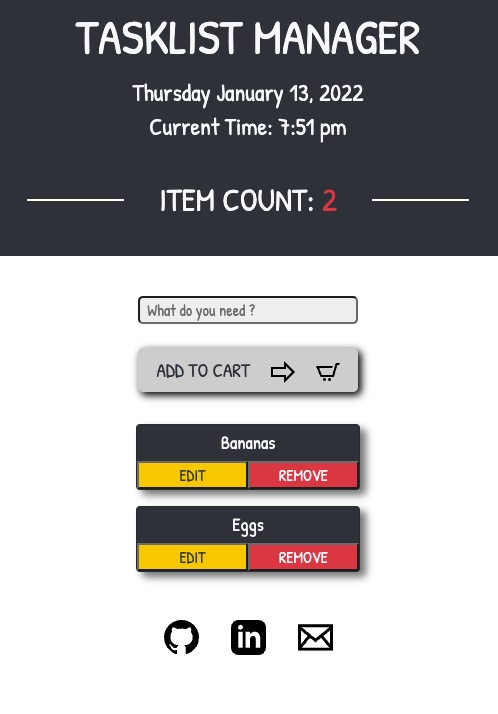

# Grocery List App 

# Table of Contents

- [Description](#description)
- [Usage](#usage)
- [Contributing](#contributing)
- [Issues](#issues)
- [License](#license)
- [Refereces](#references)

## Description:
This app was built with a React front end, MongoDB Database, and Node.js/Express.js server. 

[Link to Deployed App](https://www.family-grocery-app.herokuapp.com/)

If link won't launch
- https://family-grocery-app.herokuapp.com

## Usage:
This app allows the user to retrieve, add, edit, and delete items in their list.  Just type your item into the input box provided and add it to your list.  From there you can delete it when you've bought it, or update an item name if you wish to make a change.

## Contributing:
Contributions welcomed. Please submit a pull request.

## Issues:
-  Edit button is glitchy. 

## License:
For more information about the License, click on the link below.

## References:
-  https://reactjs.org/docs/getting-started.html
-  https://www.npmjs.com/package/react-dayjs#documentation

